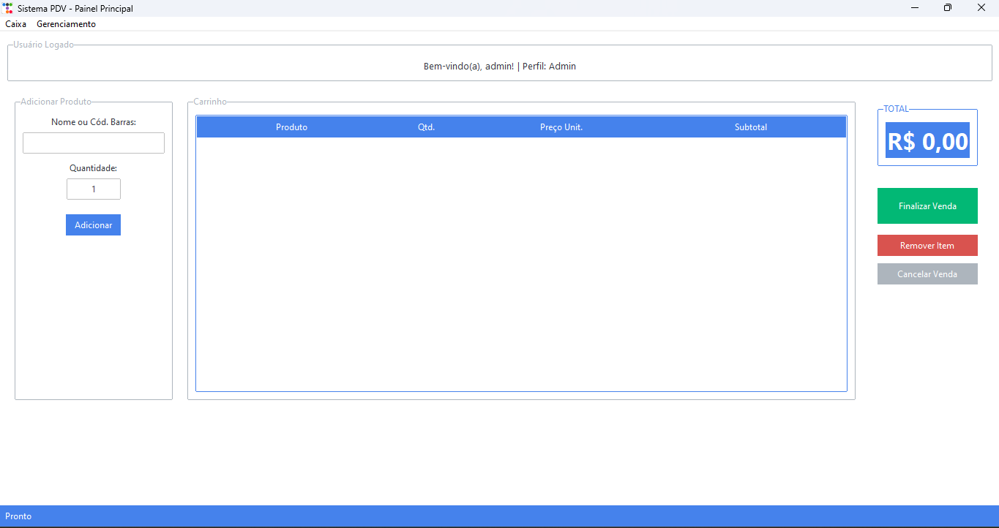

# Sistema de PDV com Previsão de Vendas (Desktop)



## 🎯 Objetivo

Este projeto é um sistema completo de Ponto de Venda (PDV) e gestão de estoque para desktop. Desenvolvido em Python, ele combina uma interface gráfica intuitiva com um backend robusto e funcionalidades de Inteligência Artificial para prever a demanda de produtos. A aplicação final é distribuída como dois executáveis separados: um para o servidor backend e outro para a interface do cliente.

## 🛠️ Tecnologias Utilizadas

* **Linguagem:** Python 3.10+
* **Interface Gráfica (Frontend):** Tkinter, com temas profissionais da `ttkbootstrap`.
* **Backend:** API local com FastAPI, rodando com Uvicorn.
* **Banco de Dados:** MongoDB.
* **Inteligência Artificial:** `Prophet` (do Facebook) para previsão de séries temporais.
* **Empacotamento:** `PyInstaller` para criar os executáveis.
* **Análise de Dados:** `Pandas` para manipulação de dados.
* **Geração de Imagens:** `Pillow` para a criação de recibos.
* **Gráficos:** `Matplotlib` para a visualização de dados nos relatórios.

## ✨ Funcionalidades

* **Autenticação por Perfil:** Sistema de login seguro com diferentes níveis de acesso.
* **Gestão de Produtos:** CRUD completo, controle de estoque e backup/restauração em JSON.
* **Ponto de Venda (PDV):** Interface ágil para registro de vendas e cálculo de troco.
* **Geração de Recibos:** Criação automática de um comprovante visual (.png) após cada venda.
* **Dashboard de Relatórios:** Visualização de KPIs (Faturamento, N° de Vendas, Ticket Médio) e gráficos.
* **Previsão de Vendas (IA):** Utiliza o histórico de vendas para prever a demanda futura de produtos.
* **Criação de Usuários:** Interface administrativa via API (Swagger UI) para criar novos usuários.

## 🚀 Como Instalar e Configurar

Siga os passos abaixo para configurar o ambiente de desenvolvimento.

**1. Pré-requisitos:**
* **Python 3.10 ou superior:** [python.org](https://www.python.org/downloads/)
* **MongoDB Community Server:** É necessário ter o MongoDB instalado e rodando na sua máquina. [Faça o download aqui](https://www.mongodb.com/try/download/community).

**2. Setup do Projeto:**
* Clone este repositório ou baixe os arquivos para uma pasta no seu computador.
* Abra o terminal e navegue até a pasta do projeto.

**3. Crie um Ambiente Virtual:**
```bash
# Cria o ambiente virtual
python -m venv venv

# Ativa o ambiente (Windows)
.\venv\Scripts\activate

# Ativa o ambiente (Linux/Mac)
source venv/bin/activate
```

**4. Instale as Dependências:**
```bash
pip install -r requirements.txt
```

**5. Crie o Primeiro Usuário no Banco:**
Execute o script `create_first_user.py` para criar um usuário `admin` com a senha `admin123`.
```bash
python create_first_user.py
```

## ⚡ Como Executar o Sistema

Existem duas formas de executar o sistema:

### Modo de Desenvolvimento (usando os scripts Python)

Ideal para fazer alterações no código. Você precisará de dois terminais.

1.  **Terminal 1 - Inicie o Backend:**
    ```bash
    uvicorn main:app --reload
    ```
2.  **Terminal 2 - Inicie o Frontend:**
    ```bash
    python login_app.py
    ```

### Modo de Produção (usando os executáveis gerados)

1.  **Inicie o Servidor:** Vá para a pasta `dist/server` e dê um clique duplo em **`server.exe`**. Uma janela de console preta aparecerá e ficará aberta. Mantenha-a assim.
2.  **Inicie a Interface:** Vá para a pasta `dist/PDVSystem` e dê um clique duplo em **`PDVSystem.exe`**. A tela de login aparecerá.

## 📦 Como Gerar os Executáveis (Build)

O processo de build cria dois executáveis independentes.

**1. Pré-requisito:**
Certifique-se de que o PyInstaller está instalado:
```bash
pip install pyinstaller
```

**2. Prepare os Arquivos de "Receita" (`.spec`)**
Você precisará de três arquivos de script (`run_server.py`, `login_app.py`, `receipt_generator.py`) e dois arquivos de "receita" (`server.spec`, `app.spec`) na pasta raiz do seu projeto. Certifique-se de que o conteúdo deles está correto, conforme definido durante o desenvolvimento.

**3. Gere os Executáveis**
Execute os seguintes comandos no terminal, na pasta raiz do projeto:

1.  **Construa o Servidor:**
    ```bash
    pyinstaller server.spec
    ```
2.  **Construa a Interface:**
    ```bash
    pyinstaller app.spec
    ```

Após a conclusão, a pasta `dist` conterá as subpastas `server` e `PDVSystem` com seus respectivos executáveis, prontos para serem usados ou distribuídos.

---